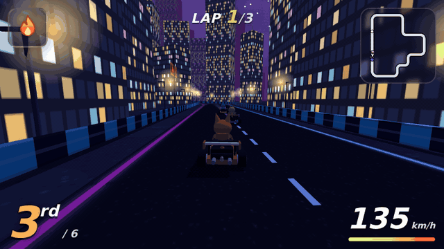
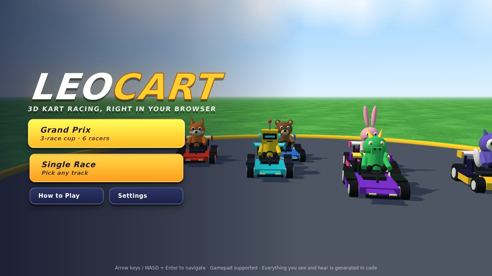
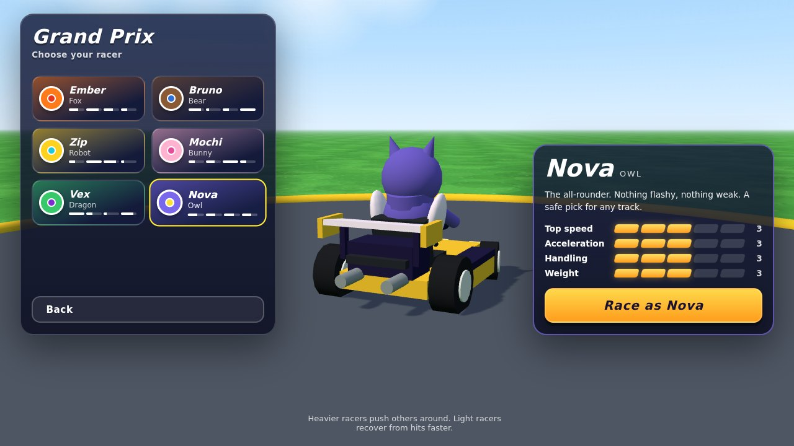
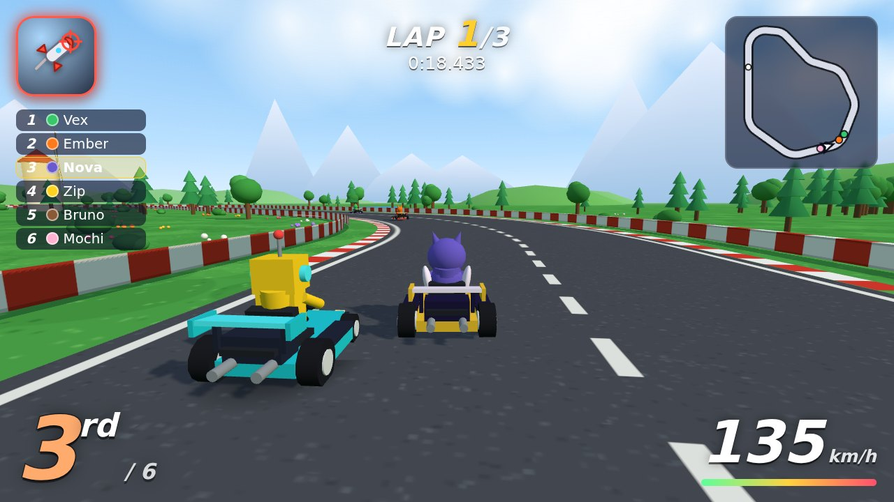
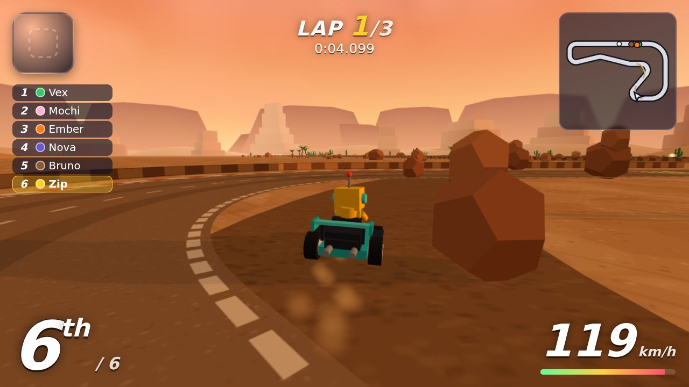
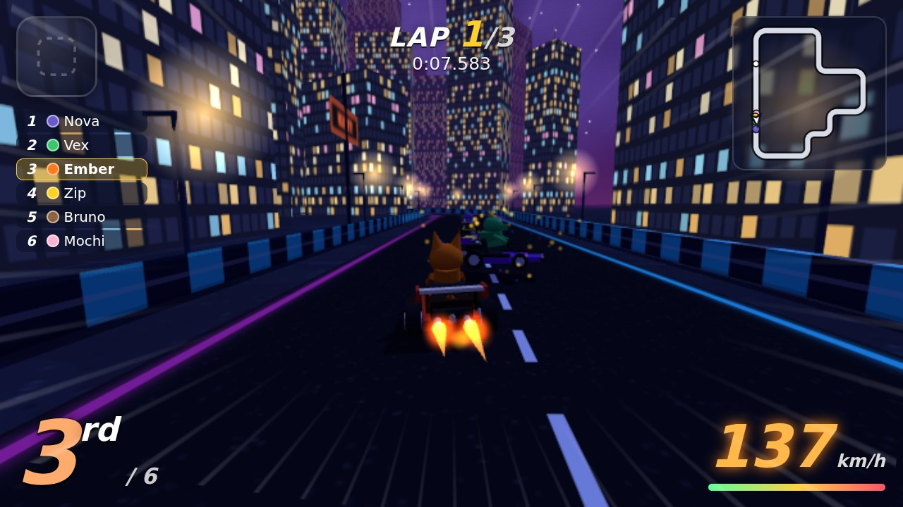
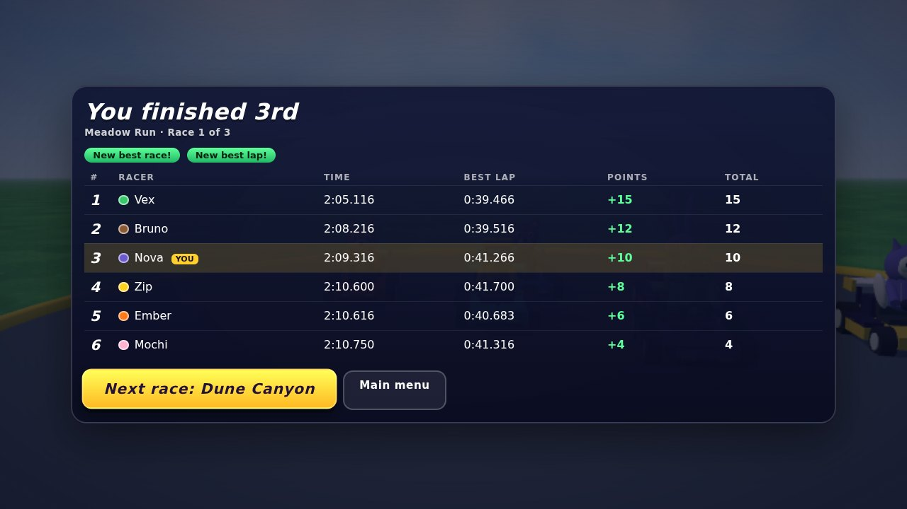

# LeoCart

**A complete 3D kart racer that runs in your browser.** Six racers, three tracks, drifting with mini-turbos, eight items, AI opponents and a three-race Grand Prix. There are no image, model or audio files in the repo: all geometry, textures, sound effects and music are generated in code.

**[▶ Play it live](https://leoloneumeister-collab.github.io/leocart/)**



| | |
|---|---|
|  |  |
|  |  |
|  |  |

Everything here is original: the characters, track layouts, item names, music and sounds. Nothing comes from any existing racing franchise.

## Features

- **Arcade driving with drifting.** Hold drift in a corner and sparks turn blue, orange, then purple. Release for a mini-turbo. Off-road slows you down, karts bump each other, and heavier racers shove lighter ones.
- **Six racers with real trade-offs.** Speed, acceleration, handling and weight each run 1 to 5, and every racer's stats add up to 12, so nobody is simply the best. Vex is the fastest kart but hard to steer; Mochi grips the road but tops out lower.
- **Three tracks.** *Meadow Run* (sunny beginner loop), *Dune Canyon* (sunset desert with two shortcuts across the hairpins) and *Neon District* (night city, staircase chicanes). Three laps each, with checkpoints so nobody can cheat a lap.
- **Eight items, weighted by position.** Bolt (throw forward or back, bounces), Seeker (homing), Turbo Cell, Turbo Trio, Oil Slick, Aegis (shield), and two comeback items for the back of the pack: Comet (invulnerable autopilot burst) and Pulse (shocks everyone ahead). Last place gets stronger items than first.
- **Five AI opponents** that follow a racing line, brake for corners, drift, dodge karts and oil, use items sensibly, take shortcuts, and rubber-band lightly. Each character has its own skill level, and there is an Easy / Normal / Hard setting.
- **Full race flow.** Intro fly-in, countdown with a rocket start, lap counter, live standings, minimap, wrong-way warning, results with points, and a 3-race cup with total standings and a podium.
- **Menus and settings.** Title, character select with stat bars, track select with saved best times, how-to-play, pause, and settings for volume, graphics quality, difficulty and rebindable keys. Menus work with keyboard and gamepad.
- **Procedural audio.** Original music for each track plus menu music, played by a small pattern sequencer built on the Web Audio API. Engine voices for every kart, tyre screech, and synthesised sound effects for items and impacts.
- **Visual polish.** Baked sky domes, fog, a shadow map that follows the player plus blob shadows, GPU particles for sparks, smoke and flames, camera shake, FOV kick on boost, and speed lines.

## Controls

| Action | Keyboard | Gamepad |
|---|---|---|
| Accelerate | `W` / `↑` | A or right trigger |
| Brake / reverse | `S` / `↓` | B or left trigger |
| Steer | `A` `D` / `←` `→` | Left stick or D-pad |
| Drift | `Shift` / `Space` | RB or LB |
| Use item (hold brake to throw backward) | `E` / `Enter` | X |
| Look back | `C` / `B` | Y |
| Reset to track | `R` | Back |
| Pause | `Esc` / `P` | Start |

All keyboard controls can be rebound in Settings.

## The racers

| Racer | Speed | Accel | Handling | Weight | Style |
|---|:-:|:-:|:-:|:-:|---|
| Ember (Fox) | 3 | 4 | 3 | 2 | Quick off the line, recovers fast |
| Bruno (Bear) | 4 | 1 | 2 | 5 | Slow starter nobody can push around |
| Zip (Robot) | 2 | 5 | 4 | 1 | Rockets to speed, bounces easily |
| Mochi (Bunny) | 2 | 3 | 5 | 2 | Glued to the road, low top speed |
| Vex (Dragon) | 5 | 2 | 1 | 4 | Fastest kart, a handful to steer |
| Nova (Owl) | 3 | 3 | 3 | 3 | The all-rounder |

## How it works

The interesting parts, if you are reading the code:

- **Tracks are rounded polygons** (`src/game/trackMath.js`). Each track is a list of corners with exact radii, resampled every 2 m. One data structure serves the road mesh, walls, minimap, AI speed profile and physics. A validator (`npm run validate`) checks corner radii and clearances.
- **Walls are a lateral limit per sample**, not mesh colliders. That makes collisions cheap and exact. A shortcut is a gap in that limit on the inside of a bend, plus a dirt ribbon and a boost pad before the entrance.
- **Progress is a signed path integral** (`TrackProbe`). Driving backward unwinds it, teleporting does not jump it, and a lap only counts after every checkpoint, so lap cheating is not possible.
- **Kart physics** (`src/game/kart.js`) keep a real world velocity. Steering rotates the heading and drags the velocity round only part of the way; grip bleeds off the sideways slip. Normal driving has high grip, drifting has low grip and high slip. That gives a slide for free, and charge time pays out as a boost.
- **The AI** (`src/game/ai.js`) uses pure pursuit on a precomputed racing line, with a per-character braking profile derived from that character's turn rate.
- **Audio** (`src/audio/`) schedules notes ahead of the clock from pattern data. Melodies are written as scale degrees so they stay in key.
- **Rendering** merges every model into vertex-coloured meshes and instances the scenery: about 110 draw calls per frame. Resolution scales automatically if the frame rate drops.

More of the reasoning is in [DECISIONS.md](DECISIONS.md).

## Tech stack

Vite 8, Three.js r186, plain JavaScript (ES modules), Web Audio API, DOM/CSS for the UI. No runtime dependencies other than Three.js and no backend. Tests use Playwright. About 7,600 lines of source.

## Run locally

```bash
git clone https://github.com/leoloneumeister-collab/leocart.git
cd leocart
npm install
npm run dev        # http://localhost:5173
```

Production build: `npm run build`, then `npm run preview` (http://localhost:4173).

## Tests

```bash
npx playwright install chromium   # first time only
npm test
```

`npm test` runs lint, track validation, and then three browser suites against a throwaway dev server:

- **End to end** (`tests/e2e.mjs`): keyboard and gamepad driving, drift and mini-turbo, pause, a full 3-lap race on all three tracks with all six karts finishing, a complete 3-race cup played through the UI, key rebinding, lap-cheat checks, and a failure on any console error or warning.
- **Audio** (`tests/audio.mjs`): renders every music loop and sound effect offline and checks they are audible, do not clip and contain no NaNs.
- **Performance budget** (`tests/perf.mjs`): simulation cost per step, draw calls and triangle counts.

`npm run sim` runs headless solo laps for every character on every track, which is how the stats were balanced.

## Deploy

The repo deploys itself: `.github/workflows/deploy.yml` builds with Vite and publishes `dist/` to GitHub Pages on every push to `main`. Vite is configured with a relative base, so the build works under any sub-path.

One-time setup, because a workflow cannot switch Pages on by itself: **Settings → Pages → Build and deployment → Source: GitHub Actions**. Then open the **Actions** tab, pick **Deploy to GitHub Pages**, and press **Re-run all jobs** (or push any commit). The site appears at `https://<your-username>.github.io/leocart/`.

To host it anywhere else, run `npm run build` and upload the `dist/` folder to any static host.

## Project layout

```
src/
  game/      track math, kart physics, AI, items, race rules, input, settings, game shell
    tracks/  the three track definitions
  render/    track meshes, scenery, kart models, textures, sky, particles, camera, menu scene
  audio/     synth engine, music data
  ui/        HUD, menus, icons, navigation, styles
scripts/     track validator and plotter, balance simulator, README media capture
tests/       end-to-end, audio and performance tests
```

## License

MIT. See [LICENSE](LICENSE).
