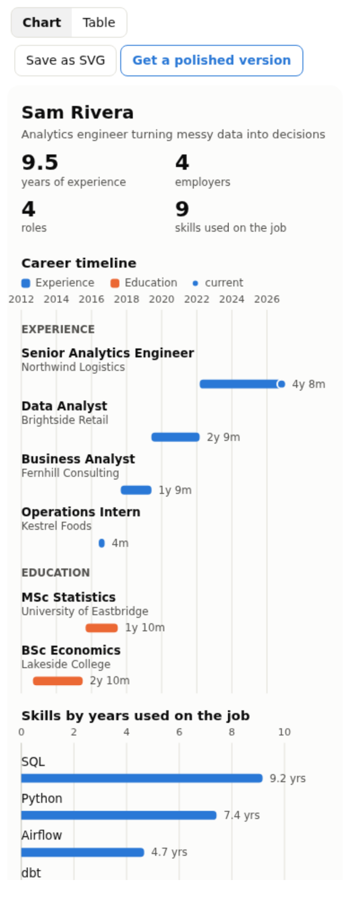
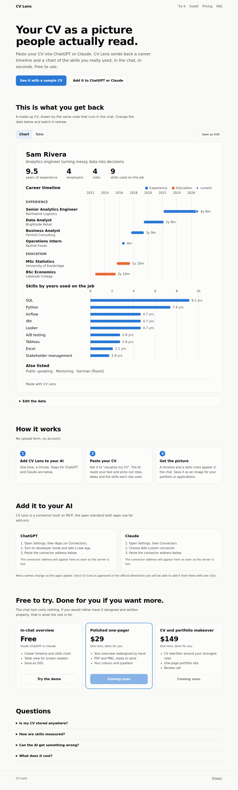

# CV Lens

Paste a CV into ChatGPT or Claude and get a one-page visual back: a career timeline and a chart of years of hands-on use per skill. It is an MCP App (one tool plus a widget), and this folder also holds the website that explains it and sells the paid offers.

| Widget in a chat (phone width) | Website |
|---|---|
|  |  |

## How it fits together

```
User pastes CV ──► ChatGPT / Claude reads it, calls visualize_cv(name, experience[], ...)
                               │
                               ▼
                   server/  (MCP, stateless)  ── normalizes dates, adds up years
                               │  structuredContent
                               ▼
                   widget/  (iframe in the chat) ── core/render.js draws the SVG
                               │
                 "Save as SVG" / "Get a polished version"  ──►  site/ (your offers)
```

- `core/` is plain JS with no dependencies: `normalize.js` (parse dates, merge overlapping jobs, years per skill) and `render.js` (SVG and table). The server, the widget and the website demo all use it.
- `server/` is the MCP server (`/mcp`, `/health`). Nothing is stored or logged. Per-IP rate limit, 100 KB body cap.
- `widget/` is the UI shown in the chat. Built to a single HTML file (`dist/widget/index.html`) because hosts load it into a sandboxed iframe with no network.
- `site/` is the static website (Vite, no framework). Everything you edit lives in [`site/config.js`](site/config.js).

Skills are measured by time, not self-rating: the model attaches skills to the roles where the CV shows them, and the chart adds up the months, counting overlapping jobs once. A CV does not say how good someone is, so the tool does not pretend to.

## Run it

```bash
cd cvlens
npm install
npm run build          # widget -> dist/widget, site -> dist/site
npm start              # MCP on http://127.0.0.1:3000/mcp
SERVE_SITE=1 npm start # same, and the website at http://127.0.0.1:3000/
npm run dev:site       # website only, with hot reload
```

Tests:

```bash
npm test               # 22 unit and protocol tests (dates, rendering, escaping, MCP over HTTP)
npm run test:e2e       # needs `npm run build` and Chromium. Drives the real widget in a
                       # sandboxed iframe with a real MCP Apps host bridge, and the website.
```

Server settings (environment variables): `PORT` (3000), `HOST` (127.0.0.1), `SITE_URL` (printed on exports and used by the widget button), `SERVE_SITE=1`, `TRUST_PROXY=1` (set behind a proxy so rate limits see real client addresses), `RATE_LIMIT_PER_MIN` (60).

## Go live

1. **Deploy to Vercel** (the repo is set up for it: `vercel.json`, `api/`). Vercel serves the website as static files and runs the MCP server as two small functions, with `/mcp` and `/health` rewritten to them.
   - In Vercel: Add New, Project, import this GitHub repo, set **Root Directory** to `cvlens`, leave the preset on Other, deploy. Or from this folder on your machine: `npx vercel --prod`.
   - Deploy **production**, not a preview. New previews sit behind Vercel's login wall by default, so ChatGPT and Claude could not reach the connector. Production domains are public.
   - Nothing else to set. The build reads Vercel's production domain, so the site prints the right connector address (`https://<project>.vercel.app/mcp`) and exports carry the right footer. Set `SITE_URL` in the project settings if you use a custom domain.
   - The rate limit is in memory, which on serverless means per instance and only a speed bump. For real abuse protection turn on Vercel's Firewall rate limiting.
   - Any container host also works: `Dockerfile` serves both from one container. It has not been built in the environment this was written in.
2. **Edit `site/config.js`.** Set `siteUrl`, `mcpUrl` (`https://your-domain/mcp`), `contactEmail`, `portfolioUrl`, and replace the placeholder offers and prices. A paid button stays disabled ("Coming soon") until its `checkoutUrl` is set, so nothing can be bought by accident. Use a Stripe Payment Link, Gumroad, Lemon Squeezy or a booking page.
3. **Add the connector yourself to test.** Claude: Settings, Connectors, Add custom connector, paste the `/mcp` URL. ChatGPT: enable developer mode, add the URL as an app. Then paste a CV and ask it to visualize.
4. **Submit to the directories** for discovery. Claude: the directory portal at claude.ai/directory/manage (MCP Apps need 3 to 5 screenshots, which `npm run test:e2e` writes to `docs/screenshots/`). ChatGPT: the app submission flow in the OpenAI developer platform. Both ask for a privacy policy URL, which is `site/privacy.html`.
5. **Publish the website.** The existing Pages workflow builds `cvlens/` and publishes it at `/cvlens/` next to the games. For its own domain, serve `dist/site` anywhere or use the container from step 1.

## What I could not verify

- **The Vercel deployment itself.** The functions are tested on a plain Node server (raw and pre-parsed bodies), not on Vercel's runtime, which I could not reach from here. The first deploy is the real test: check `https://<project>.vercel.app/health`.
- **Rendering inside the real ChatGPT and Claude apps.** The widget is tested against the official MCP Apps host bridge (`@modelcontextprotocol/ext-apps`), not the products. A `window.openai` fallback is included for ChatGPT's older surface, but OpenAI's docs were unreachable from this environment, so that path is untested.
- **Directory review.** Rules change. Check each directory's current guidelines, in particular how they treat apps that point to your own site. The model-facing tool text carries no promotion on purpose; the only call to action is a button in the widget.
- **Who may submit to Claude's directory.** Sources disagree on whether an individual paid plan is enough or a Team or Enterprise organisation is required. Check at submission time.
- **The privacy page** is a plain-language draft that matches what the code does. Have it checked against your own jurisdiction and hosting provider before you rely on it.
