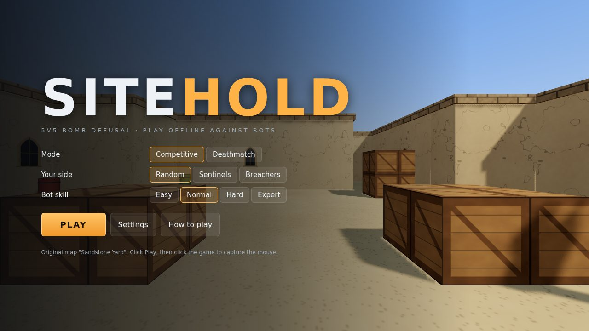
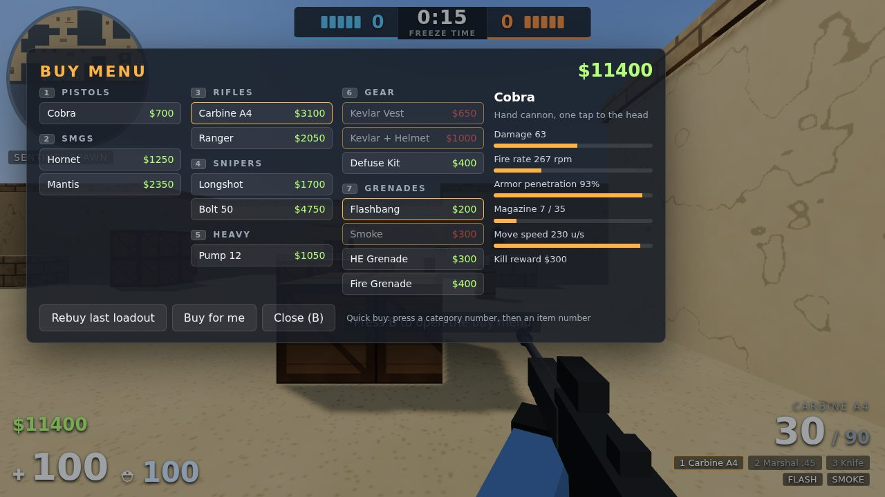
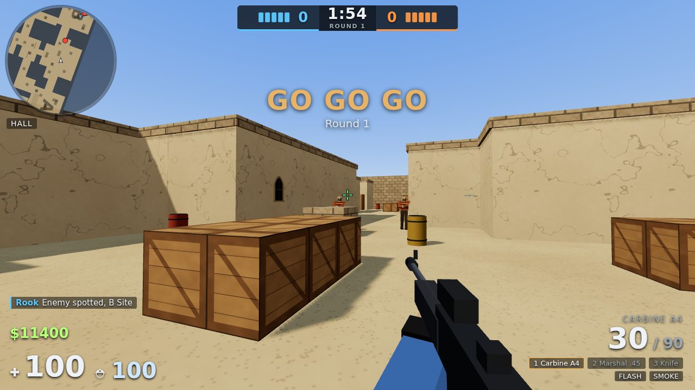
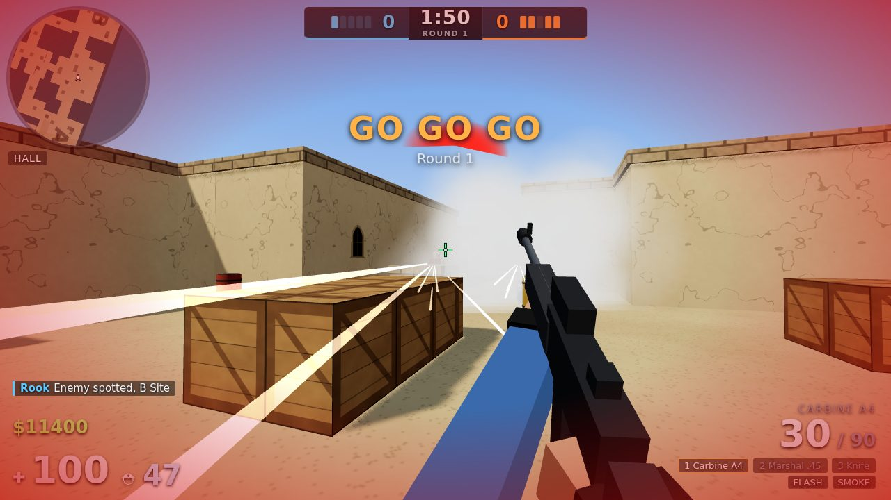
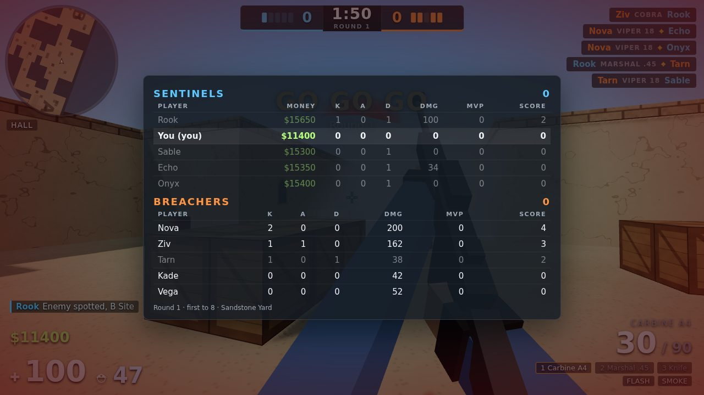
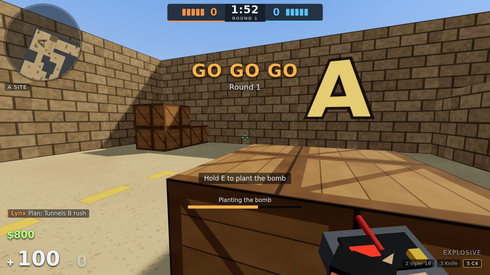

# SITEHOLD

A CS:GO style 5v5 bomb defusal shooter that runs in your browser. You and four bot teammates against five bots, offline, no downloads. Everything (map, textures, models, sounds, music) is generated in code.

It borrows the **feel** of CS:GO and none of Valve's content: original name, original map ("Sandstone Yard"), original teams (Sentinels defend, Breachers attack) and original weapon names with the same roles.

**Play it:** `npm install && npm run dev`, open the URL Vite prints, click **Play**, click the game to capture the mouse. When this repo is deployed with GitHub Pages it is published at `/sitehold/`. For Vercel, import the repo and set **Root Directory** to `sitehold` (`vercel.json` does the rest).

| | |
|---|---|
|  |  |
|  |  |
|  |  |

## What is in it

- **Competitive mode, shortened.** First to 8 round wins, 14 rounds max, sides swap after round 7, a 7 to 7 tie goes to one sudden death round with $10,000 each. 12 s freeze and buy time, 1:55 round, 40 s bomb, 3.2 s plant, 10 s defuse (5 s with a kit).
- **Deathmatch.** Free for all against 7 bots, 10 minutes, instant respawn, no economy. Press B to pick any weapon. Good for warming up.
- **Real movement.** Quake style ground and air acceleration with CS values (accel 5.5, friction 5.2, air accel 12 with a 0.76 m/s air cap). Counter strafing, air strafing, crouch jumps, stairs, ramps, 1.45 m jumps, fall damage above 3.5 m. Footsteps are audible when running, silent when walking or crouched.
- **Real gunplay.** Hitscan with a fixed 40 bullet spray pattern per weapon, first shot accurate when you stand still, spread from movement, jumping and sustained fire. The camera shows 45 percent of the recoil (like CS), bullets use all of it, so you learn to pull down. Per body part hitboxes: head x4, chest x1, stomach x1.25, arms x1, legs x0.75. Armor and helmets use the CS formula. Wooden walls and crates can be shot through with reduced damage.
- **13 weapons plus a knife.** Three pistols, three SMGs, four rifles, two snipers (one with two zoom levels), a pump shotgun.
- **Utility.** Flashbang (blinds, rings your ears, bots turn away), smoke (blocks vision for 18 s, bots cannot see through it), HE grenade, fire grenade. Left click throws far, right click short, both for a lob.
- **Economy.** $800 start, $16,000 cap, kill rewards by weapon class, win bonus, loss bonus streak $1,400 to $3,400, plant bonus, defuse bonus, weapons that survive carry over. Buy menu (B), rebuy last loadout, auto buy.
- **Bots that play the objective.** They buy as a team (pistol, eco, force, full), pick a round plan (long rush, short, split, mid control, tunnels, slow executes behind smoke and flash), hold angles, rotate on intel, plant, fall back to defend the bomb, retake with utility, defuse, save weapons when the round is lost, and call things out over the radio. Four skill levels.
- **One original map.** Two bombsites, three lanes (Long, Mid with a door, Tunnels), short routes from Mid, an elevated roost with a ramp, thin wooden walls for wallbangs, a staggered wall in lower Mid so there is no sightline to spawn.
- **HUD and UI.** Health, armor, money, ammo, round timer, bomb timer, scores and alive icons, killfeed (headshot and wallbang icons), rotating radar with callouts, location text, damage direction indicator, hit marker, scoreboard (Tab), spectating teammates when dead, round summary with MVP, results screen with career stats. Settings for sensitivity, field of view, crosshair editor, volume, graphics quality and key bindings.
- **Audio.** Per weapon gunshots with distance filtering and reverb, 3D positioned (HRTF), footsteps by surface, accelerating bomb beep, flash ringing, reload and equip clicks, radio blips, short menu music loop. No music in rounds.

## Controls

| Action | Default |
|---|---|
| Move | `W` `A` `S` `D` |
| Jump / crouch / walk quietly | `Space` / `Ctrl` or `C` / `Shift` |
| Fire / scope or short throw | Left click / Right click |
| Reload | `R` |
| Primary, pistol, knife, grenades, bomb | `1` `2` `3` `4` `5` (press `4` again to cycle grenades) |
| Last weapon, drop weapon | `Q`, `G` |
| Use: plant, defuse, pick up | `E` (hold) |
| Buy menu | `B` (freeze time) |
| Ask a bot teammate to drop you a rifle | `X` (freeze time) |
| Scoreboard / mute | `Tab` / `M` |
| Pause | `Esc` |

Mouse wheel switches weapons by default, or can be bound to jump in Settings. All keys can be rebound. Gamepad and touch are not supported on purpose, it is a mouse and keyboard game.

## Tips

- Stop before you shoot. Tap the opposite direction key (counter strafe) and the first bullet is dead accurate.
- Spray patterns are always the same. Pull the mouse down and a little sideways to cancel them.
- Rifles one tap to the head at range. The heavy sniper kills with one body shot.
- Smoke the door, flash the corner, then go.

## Scripts

```bash
npm run dev          # dev server
npm run build        # typecheck and production build into dist/
npm run preview      # serve the production build
npm run single       # one self contained dist/sitehold.html you can open by double clicking
npm test             # fast tests: types, map validation, movement, guns, 10 bot matches
npm run test:browser # end to end test in headless Chromium (about a minute)
npm run test:all     # both
npm run sim          # 20 bot only matches, prints balance and stats
npm run sim:full     # 100 matches
npm run validate     # check the map for unreachable routes, holds and sites
node scripts/capture-media.mjs   # regenerate the screenshots above (after npm run build)
node scripts/plot-round.mjs 3 2  # top down plot of one bot round (seed, round) into tests/shots
```

## How it is built

TypeScript, Vite, Three.js. No physics engine and no asset files.

```
src/sim/     the whole game with no DOM or Three.js, runs at a fixed 64 Hz
  movement   Quake style movement and collision
  world      AABB world with a grid, raycasts
  map        the map as a 2 m grid plus ramps and thin walls
  nav        navigation grid generated from the collision world, A*
  combat     hitscan, hitboxes, armor, penetration, spray patterns
  grenades   grenade physics, smoke, flash, HE, fire, throw solver for bots
  sim        rounds, economy, bomb, drops, deathmatch
  bots       per bot perception, aim, firing, movement
  teamai     buying, plans, rotations, retakes
src/render/  Three.js: map mesh, characters, viewmodels, effects, textures
src/game/    game loop, input, audio, settings
src/ui/      HUD, panels, menus
```

The simulation is separate from rendering, so `npm run sim` plays whole matches in Node with no GPU. The same code runs in the browser. Bots only produce the same input a player does (move, look, fire) and see through the same line of sight function, so they have no wallhack.

## Debug URL flags

Add to the URL: `?debug` (FPS and `window.__game`), `auto` (skip the menu), `mode=dm`, `side=0|1`, `diff=0..3`, `seed=N`, `god`, `money=16000`, `round=N` (fast forward N rounds), `bots=0` (bots stand still, for aim practice).

## Honest limits

- It looks stylized, not photoreal. There are no pro art assets. Lighting, shadows and animation carry the look.
- Bot quality is the biggest risk. Headless matches prove they do not break and keep the game balanced (about 50 percent). They cannot prove they are fun. Expect to tune them to taste, the knobs are in `src/sim/constants.ts` (`BOT_LEVELS`) and `src/sim/teamai.ts`.
- Mouse feel cannot be tested without a human. The numbers follow CS but small tweaks to sensitivity or recoil may help.
- Wallbangs, hit registration and movement are close approximations of Source, not tick exact copies.
- No online multiplayer. It would roughly double the project (netcode, lag compensation, a server).
- Tested in headless Chromium with software rendering. Not tested on real GPUs, Safari or Firefox.

See `DECISIONS.md` for the judgment calls and known gaps, and `docs/SUPER_PROMPT.md` for the build spec this game was made from.
